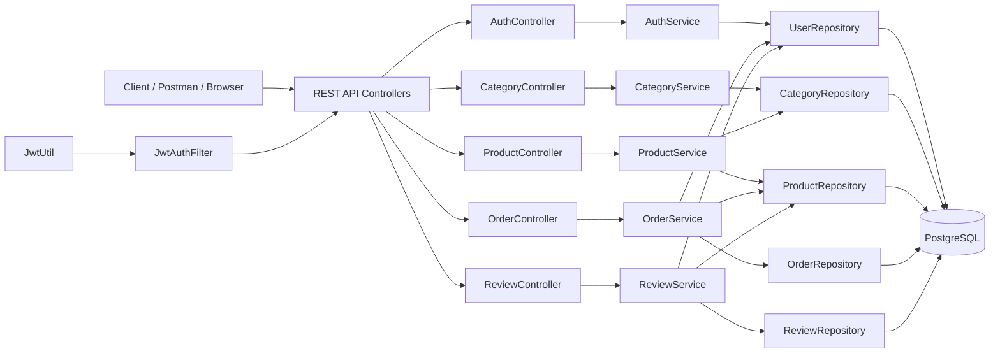
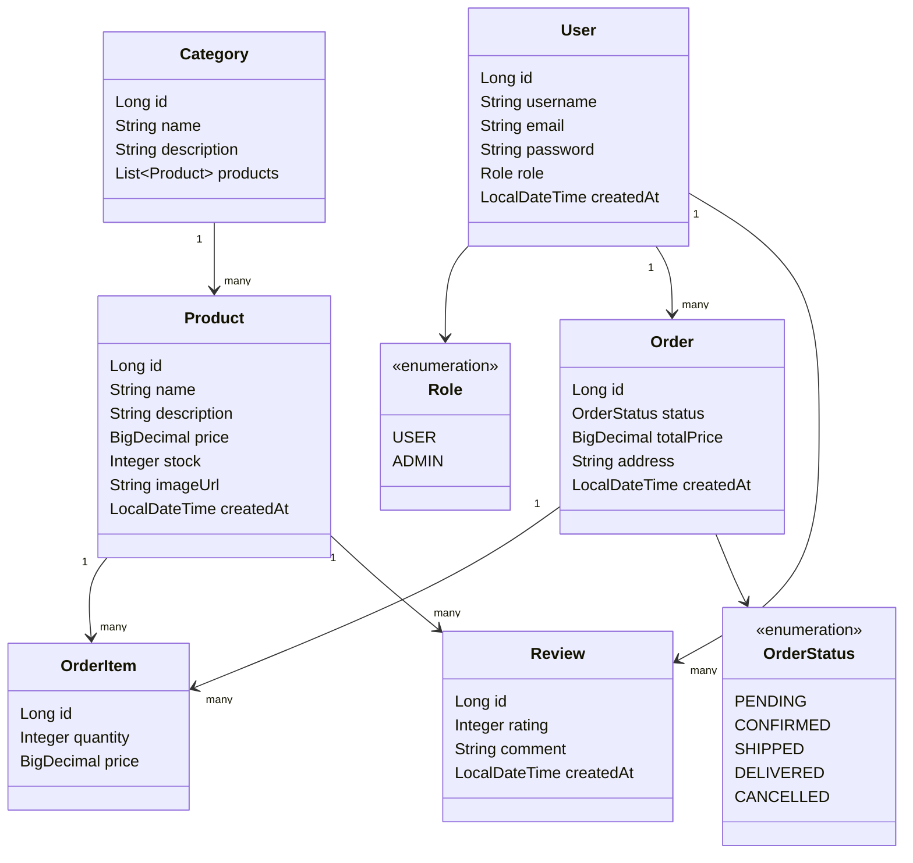
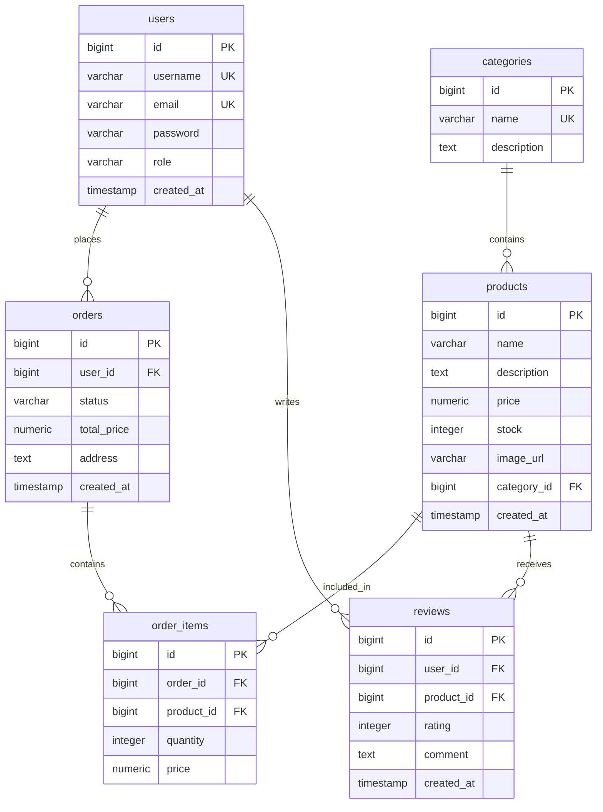

# ShopApp Diagrams

## Architecture Diagram

## UML Class Diagram

## Database Schema / ERD

## Component Responsibilities

- Controller layer accepts HTTP requests, validates DTOs, and returns REST responses.
- Service layer contains business logic: authentication, category/product CRUD, order totals, review ownership checks.
- Repository layer uses Spring Data JPA to access PostgreSQL tables.
- Security layer uses JWT tokens and role checks for protected operations.
- PostgreSQL stores users, products, categories, orders, order items, and reviews.
